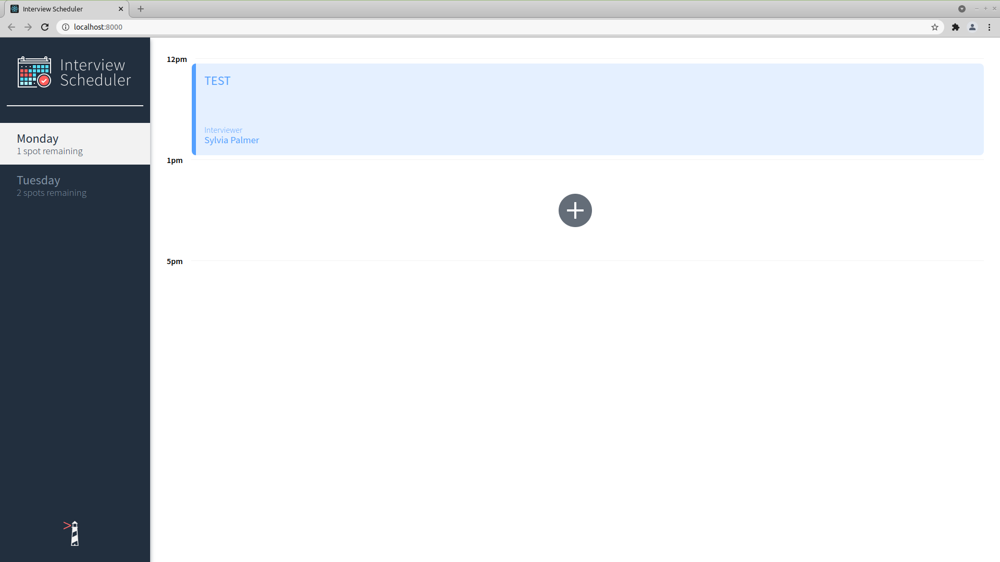
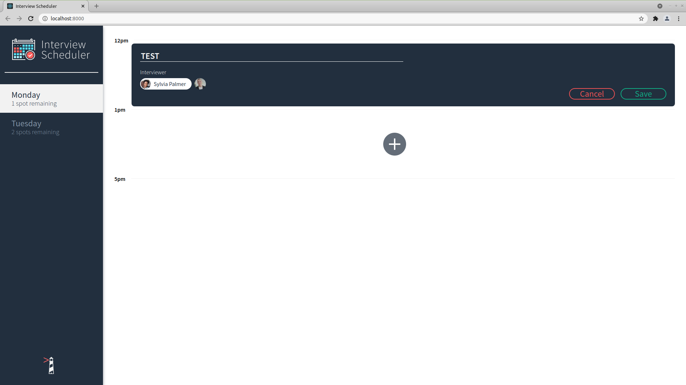

# Interview Scheduler

## Setup

Install dependencies with `npm install`. See `scheduler-api` repo for instructions to install development api.

## Running Webpack Development Server

```sh
npm start
```

## Running Jest Test Framework

```sh
npm test
```

## Running Storybook Visual Testbed

```sh
npm run storybook
```




## Dependencies

- Axios 0.21.1 or above
- Classnames 2.2.6 or above
- Normalize.css 8.0.1 or above
- React 16.9.0 or above
- React-dom 16.9.0 or above
- React-scripts 3.0.0 or above